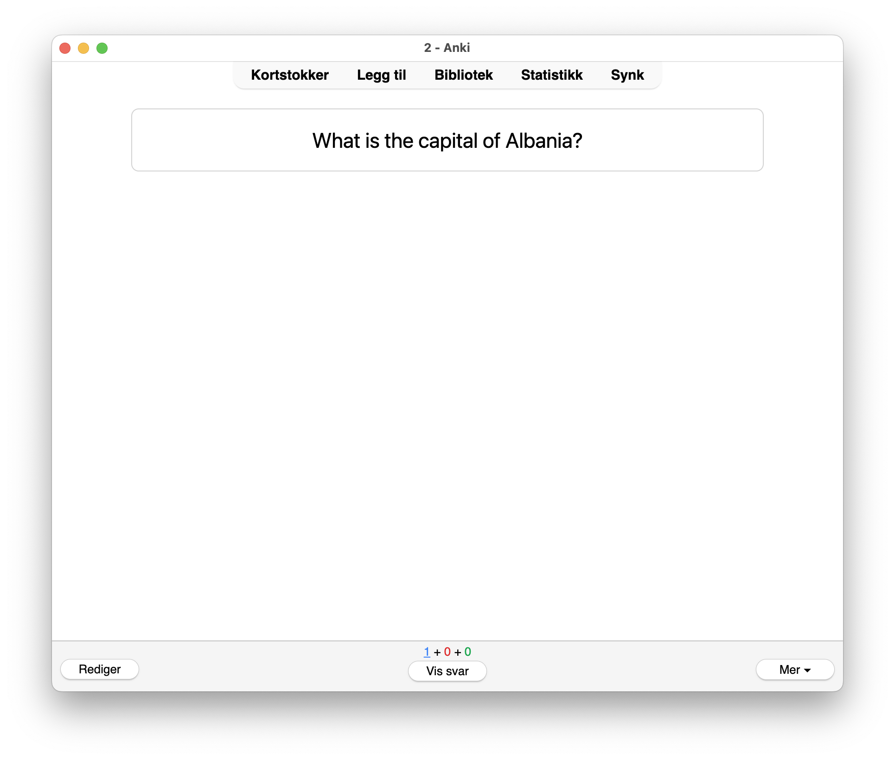
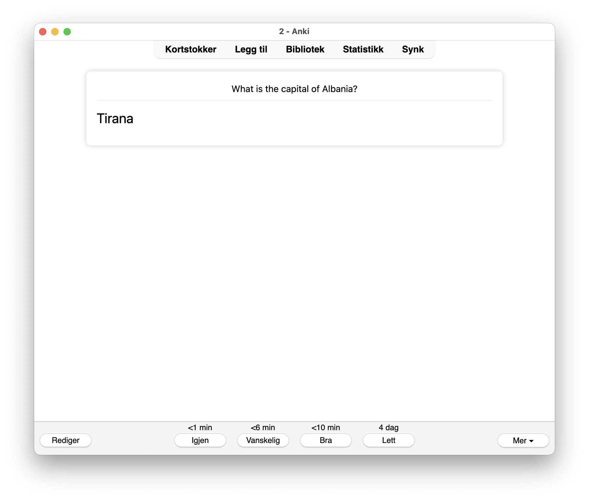
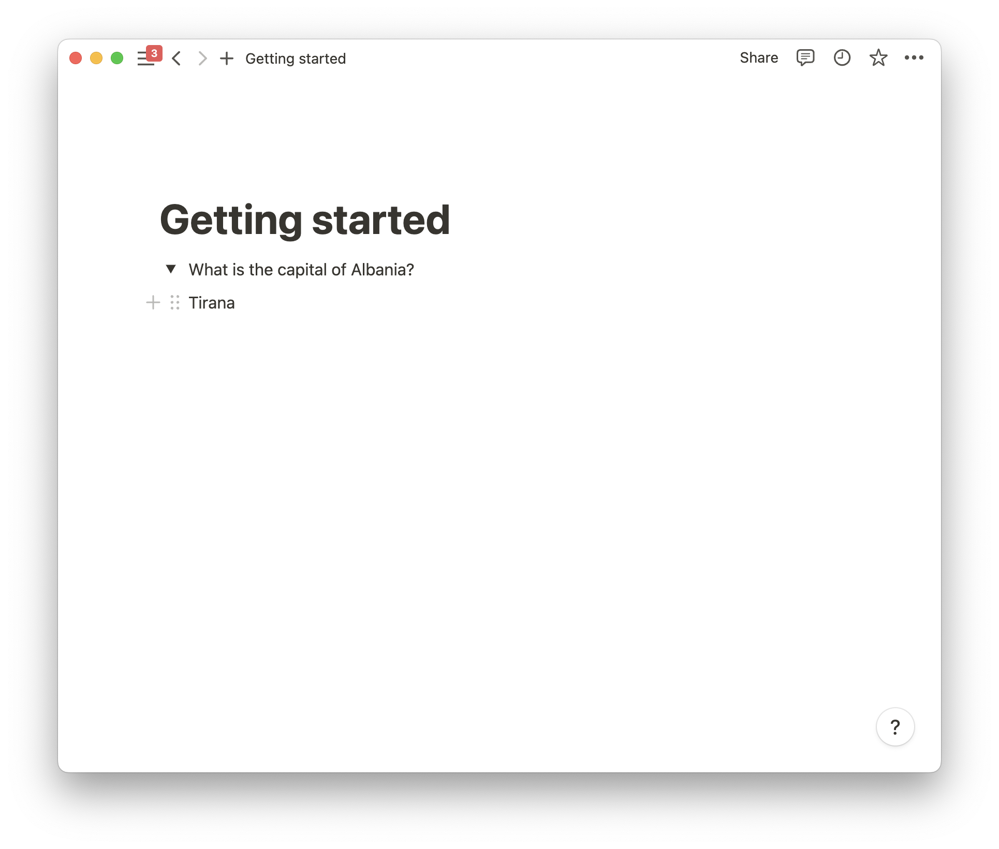
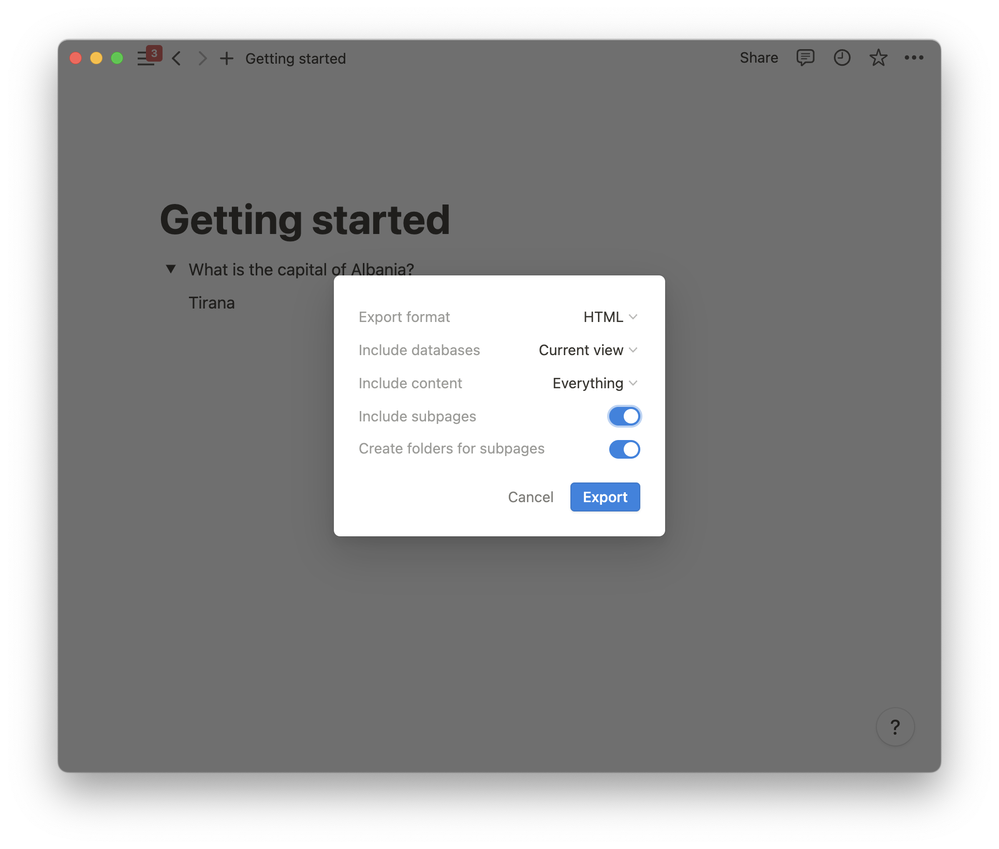

2anki.net supports uploading HTML, CSV and Markdown files. It also possible to use the Notion API
which will not be covered in this guide.

## What is a flashcard?

By default in 2anki.net the basic unit of a flashcard is a toggle. We will keep it simple for now
and only look at basic flashcards.  

### Basic card

Here we have a toggle. In the **summary** there is a question, `What is the capital of Albania?`. 
Try clicking it below to expand it for the details, `Tirana!`.

<details style="max-width: 90%; margin: 0 auto;">
        <summary>What is the capital of Albania?</summary>
        Tirana!
</details>

That is it. A basic flashcard. When converting your toggles, they will show up like this in Anki.

#### Basic front



#### Basic back




## Exercise: Creating Anki flashcards from Notion notes

Head on over to your [Notion](https://www.notion.so/) and create a new page. 

If you are not familiar with Notion or do not use it, you can create a HTML file and paste in the following:

```html
<details>
        <summary>What is the capital of Albania?</summary>
        Tirana!
</details>
```

### Creating your toggle

If you are using Notion, create a new toggle block. It should look something like this

.

### Exporting your notes

Notion allows you to export your pages and databases. Look for an ellipsis (…) button that is usually in the upper right corner.
When you click it a modal like the one below shows up. Make sure to check of everything and note that the export format is `HTML`. Then you can click export to save your file.

.

### Uploading your notes

You should now have a zip file ready. Head on over to https://2anki.net/upload
Drag and drop the file or click to select it. This will download a APKG file to your computer.
You can try opening this file and it should start Anki for you with a confirmation dialog on the
imports.


Voilà, you just made your first Anki flashcard with 2anki.net.