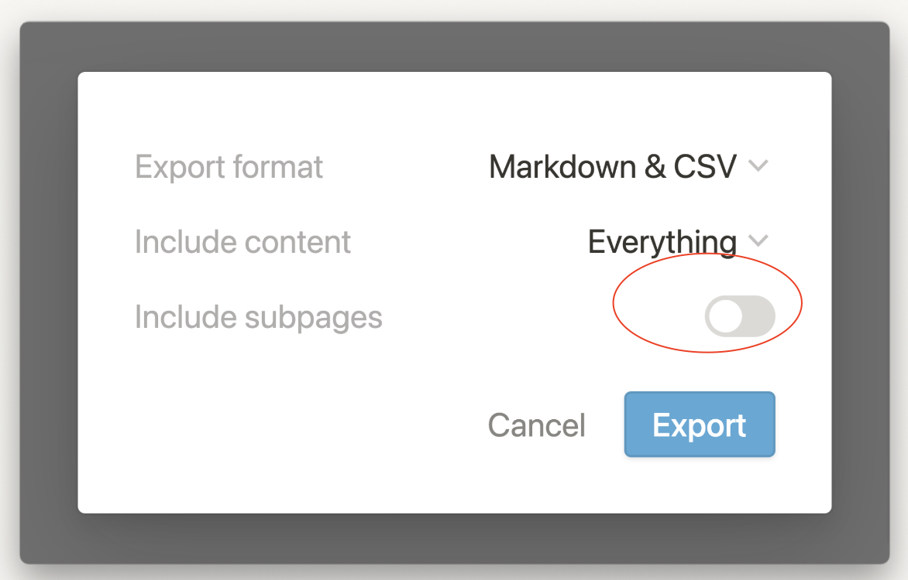

If you are wondering how to use 2anki.net, please checkout the official YouTube playlist: [💫 Notion to Anki](https://www.youtube.com/playlist?list=PLzOAzzqpDqukOtwH3IYWiOhr_sjBjfgCd)

## Error: Could not create a deck using your file and rules.

2anki.net by default uses toggles unless you are converting with the Notion integration where it is possible to define your own rules. Somethings you can check are

- Ensure you have toggles in your export, here is a video example: [Notion to Anki - How I use these apps as a medical student](https://youtu.be/UnTo_fN1jpc)
- Ensure you have correctly exported your file with the subpages https://www.notion.so/help/export-your-content#export-as-html

## Some images are missing, what do I do?

If you uploaded a HTML only make sure to use the ZIP, the filename ends with `.zip`. Some browsers automatically unpackage safe files like zip, so make sure to disable that behaviour. 

For Safari it's

1. Open Safari
2. Click **Preferences**
3. Under the General tab, uncheck the option ***Open “safe” files after downloading***

Reference: [How do I stop automatically unzipping downloaded zip files in Mac Safari?](https://wiki.umbc.edu/pages/viewpage.action?pageId=31919091)